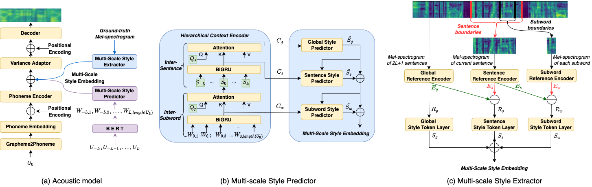

# Abstract

Previous works on expressive speech synthesis focus on modelling the mono-scale style embedding from the current sentence or context, but the multi-scale nature of speaking style in human speech is neglected. In this paper, we propose a multi-scale speaking style modelling method to capture and predict multi-scale speaking style for improving the naturalness and expressiveness of synthetic speech. A multi-scale extractor is proposed to extract speaking style embeddings at three different levels from the ground-truth speech, and explicitly guide the training of a multi-scale style predictor based on hierarchical context information. Both objective and subjective evaluations on a Mandarin audiobooks dataset demonstrate that our proposed method can significantly improve the naturalness and expressiveness of the synthesized speech.

    
     
    
 Fig.1: The architecture of our proposed model. 

    
     
    
 Fig.2: The structure of the multi-scale style extractor. 

    
     
    
 Fig.3: The structure of the multi-scale style predictor. 

# Subjective Evaluation 
To demonstrate that our proposed model can significantly improve the naturalness and expressiveness of the synthesized speech, some samples are provided for comparison. **GT** means ground truth. **FastSpeech 2** means  an open-source implementation of FastSpeech 2. **WSV\*** means WSV with several changes which are described in detail in the paper.  And **HCE** means hierarchical context encoder (HCE) model, which predicts the style on global-level from the context. In addition, a well-trained HIFI-GAN is used as the vocoder to generate waveform.

| Target Chinese Text | GT | FastSpeech 2 | WSV* | HCE | Proposed |
| :---- | :---: | :---- | :---- | :---- | ----- |
| 小公母儿俩一进屋儿，屋儿里又多了两个人。 | <audio controls><source src="./wavs/gt/3.wav" type="audio/wav">Your browser does not support the audio element.</audio> | <audio controls><source src="./wavs/fs2/3.wav" type="audio/wav">Your browser does not support the audio element.</audio> | <audio controls><source src="./wavs/wsv/3.wav" type="audio/wav">Your browser does not support the audio element.</audio> | <audio controls><source src="./wavs/hce/3.wav" type="audio/wav">Your browser does not support the audio element.</audio> | <audio controls><source src="./wavs/proposed/3.wav" type="audio/wav">Your browser does not support the audio element.</audio> |
| 晚上，赏三两小醑酒,又把客人吃剩的汤菜做成杂烩，送到砦四海的窝棚。 | <audio controls><source src="./wavs/gt/4.wav" type="audio/wav">Your browser does not support the audio element.</audio> | <audio controls><source src="./wavs/fs2/4.wav" type="audio/wav">Your browser does not support the audio element.</audio> | <audio controls><source src="./wavs/wsv/4.wav" type="audio/wav">Your browser does not support the audio element.</audio> | <audio controls><source src="./wavs/hce/4.wav" type="audio/wav">Your browser does not support the audio element.</audio> | <audio controls><source src="./wavs/proposed/4.wav" type="audio/wav">Your browser does not support the audio element.</audio> |
| 小兔崽子！抓帽胡同儿的这几个哈哈珠砸又团聚啦。 | <audio controls><source src="./wavs/gt/7.wav" type="audio/wav">Your browser does not support the audio element.</audio> | <audio controls><source src="./wavs/fs2/7.wav" type="audio/wav">Your browser does not support the audio element.</audio> | <audio controls><source src="./wavs/wsv/7.wav" type="audio/wav">Your browser does not support the audio element.</audio> | <audio controls><source src="./wavs/hce/7.wav" type="audio/wav">Your browser does not support the audio element.</audio> | <audio controls><source src="./wavs/proposed/7.wav" type="audio/wav">Your browser does not support the audio element.</audio> |
| 寥花儿打累了，也把胆怯的心给打没了，拥被坐着，喘着粗气。 | <audio controls><source src="./wavs/gt/10.wav" type="audio/wav">Your browser does not support the audio element.</audio> | <audio controls><source src="./wavs/fs2/10.wav" type="audio/wav">Your browser does not support the audio element.</audio> | <audio controls><source src="./wavs/wsv/10.wav" type="audio/wav">Your browser does not support the audio element.</audio> | <audio controls><source src="./wavs/hce/10.wav" type="audio/wav">Your browser does not support the audio element.</audio> | <audio controls><source src="./wavs/proposed/10.wav" type="audio/wav">Your browser does not support the audio element.</audio> |
| 马嵬坡下草青青，今日犹存妃子陵。 | <audio controls><source src="./wavs/gt/16.wav" type="audio/wav">Your browser does not support the audio element.</audio> | <audio controls><source src="./wavs/fs2/16.wav" type="audio/wav">Your browser does not support the audio element.</audio> | <audio controls><source src="./wavs/wsv/16.wav" type="audio/wav">Your browser does not support the audio element.</audio> | <audio controls><source src="./wavs/hce/16.wav" type="audio/wav">Your browser does not support the audio element.</audio> | <audio controls><source src="./wavs/proposed/16.wav" type="audio/wav">Your browser does not support the audio element.</audio> |
| 郭二坏一眼瞥见余为农，行色匆匆地顺着二道街往前奔。 | <audio controls><source src="./wavs/gt/19.wav" type="audio/wav">Your browser does not support the audio element.</audio> | <audio controls><source src="./wavs/fs2/19.wav" type="audio/wav">Your browser does not support the audio element.</audio> | <audio controls><source src="./wavs/wsv/19.wav" type="audio/wav">Your browser does not support the audio element.</audio> | <audio controls><source src="./wavs/hce/19.wav" type="audio/wav">Your browser does not support the audio element.</audio> | <audio controls><source src="./wavs/proposed/19.wav" type="audio/wav">Your browser does not support the audio element.</audio> |

* * *

# Ablation Study 
### Investigation on global-level style

| Target Chinese Text | Proposed | without global-level style | GT |
| :---- | :---- | :---- | ----- |
| 您老放心,漫说开荒累不死人，就是赴汤蹈火，您侄子第一个跳进去。 | <audio controls><source src="./wavs/cmos1/0.wav" type="audio/wav">Your browser does not support the audio element.</audio> | <audio controls><source src="./wavs/cmos1/-0.wav" type="audio/wav">Your browser does not support the audio element.</audio> | <audio controls><source src="./wavs/cmos1/g0.wav" type="audio/wav">Your browser does not support the audio element.</audio> |
| 小公母儿俩一进屋儿，屋儿里又多了两个人。 | <audio controls><source src="./wavs/cmos1/1.wav" type="audio/wav">Your browser does not support the audio element.</audio> | <audio controls><source src="./wavs/cmos1/-1.wav" type="audio/wav">Your browser does not support the audio element.</audio> | <audio controls><source src="./wavs/cmos1/g1.wav" type="audio/wav">Your browser does not support the audio element.</audio> |
| 西施留在了汪家，桃儿才体会到了什么叫汪大奶奶。 | <audio controls><source src="./wavs/cmos1/2.wav" type="audio/wav">Your browser does not support the audio element.</audio> | <audio controls><source src="./wavs/cmos1/-2.wav" type="audio/wav">Your browser does not support the audio element.</audio> | <audio controls><source src="./wavs/cmos1/g2.wav" type="audio/wav">Your browser does not support the audio element.</audio> |
| 小施主，关老爷一生最重一个义字。 | <audio controls><source src="./wavs/cmos1/3.wav" type="audio/wav">Your browser does not support the audio element.</audio> | <audio controls><source src="./wavs/cmos1/-3.wav" type="audio/wav">Your browser does not support the audio element.</audio> | <audio controls><source src="./wavs/cmos1/g3.wav" type="audio/wav">Your browser does not support the audio element.</audio> |
| 乌雅氏和勾秀云早已经捷足先登了。 | <audio controls><source src="./wavs/cmos1/4.wav" type="audio/wav">Your browser does not support the audio element.</audio> | <audio controls><source src="./wavs/cmos1/-4.wav" type="audio/wav">Your browser does not support the audio element.</audio> | <audio controls><source src="./wavs/cmos1/g4.wav" type="audio/wav">Your browser does not support the audio element.</audio> |

### Investigation on multi-scale framework 

| Target Chinese Text | Proposed | without multi-scale framework | GT |
| :---- | :---- | :---- | ----- |
| 终于有人跳下了炕，明保脑瓜皮酥了一下。 | <audio controls><source src="./wavs/cmos2/0.wav" type="audio/wav">Your browser does not support the audio element.</audio> | <audio controls><source src="./wavs/cmos2/-0.wav" type="audio/wav">Your browser does not support the audio element.</audio> | <audio controls><source src="./wavs/cmos2/g0.wav" type="audio/wav">Your browser does not support the audio element.</audio> |
| 他使劲儿拍了拍穆隆阿，又使劲儿拍了拍六格，骂了一句。 | <audio controls><source src="./wavs/cmos2/1.wav" type="audio/wav">Your browser does not support the audio element.</audio> | <audio controls><source src="./wavs/cmos2/-1.wav" type="audio/wav">Your browser does not support the audio element.</audio> | <audio controls><source src="./wavs/cmos2/g1.wav" type="audio/wav">Your browser does not support the audio element.</audio> |
| 小兔崽子！抓帽胡同儿的这几个哈哈珠砸又团聚啦。 | <audio controls><source src="./wavs/cmos2/2.wav" type="audio/wav">Your browser does not support the audio element.</audio> | <audio controls><source src="./wavs/cmos2/-2.wav" type="audio/wav">Your browser does not support the audio element.</audio> | <audio controls><source src="./wavs/cmos2/g2.wav" type="audio/wav">Your browser does not support the audio element.</audio> |
| 瓜尔佳氏哼了一声，呵斥道。 | <audio controls><source src="./wavs/cmos2/3.wav" type="audio/wav">Your browser does not support the audio element.</audio> | <audio controls><source src="./wavs/cmos2/-3.wav" type="audio/wav">Your browser does not support the audio element.</audio> | <audio controls><source src="./wavs/cmos2/g3.wav" type="audio/wav">Your browser does not support the audio element.</audio> |
| 必须用你的目光逼退鹰眼射出的寒光。 | <audio controls><source src="./wavs/cmos2/4.wav" type="audio/wav">Your browser does not support the audio element.</audio> | <audio controls><source src="./wavs/cmos2/-4.wav" type="audio/wav">Your browser does not support the audio element.</audio> | <audio controls><source src="./wavs/cmos2/g4.wav" type="audio/wav">Your browser does not support the audio element.</audio> |

### Investigation on residual style embedding

| Target Chinese Text                                          | Proposed                                                     | without residual style embedding                             | GT                                                           |
| :----------------------------------------------------------- | :----------------------------------------------------------- | :----------------------------------------------------------- | ------------------------------------------------------------ |
| 您老放心，漫说开荒累不死人，就是赴汤蹈火，您侄子第一个跳进去。 | <audio controls><source src="./wavs/cmos3/0.wav" type="audio/wav">Your browser does not support the audio element.</audio> | <audio controls><source src="./wavs/cmos3/-0.wav" type="audio/wav">Your browser does not support the audio element.</audio> | <audio controls><source src="./wavs/cmos3/g0.wav" type="audio/wav">Your browser does not support the audio element.</audio> |
| 勾秀云嘴上缺个把门儿的，她调笑四海。                         | <audio controls><source src="./wavs/cmos3/1.wav" type="audio/wav">Your browser does not support the audio element.</audio> | <audio controls><source src="./wavs/cmos3/-1.wav" type="audio/wav">Your browser does not support the audio element.</audio> | <audio controls><source src="./wavs/cmos3/g1.wav" type="audio/wav">Your browser does not support the audio element.</audio> |
| 小兔崽子！抓帽胡同儿的这几个哈哈珠砸又团聚啦。               | <audio controls><source src="./wavs/cmos3/2.wav" type="audio/wav">Your browser does not support the audio element.</audio> | <audio controls><source src="./wavs/cmos3/-2.wav" type="audio/wav">Your browser does not support the audio element.</audio> | <audio controls><source src="./wavs/cmos3/g2.wav" type="audio/wav">Your browser does not support the audio element.</audio> |
| 瓜尔佳氏哼了一声，呵斥道。                                   | <audio controls><source src="./wavs/cmos3/3.wav" type="audio/wav">Your browser does not support the audio element.</audio> | <audio controls><source src="./wavs/cmos3/-3.wav" type="audio/wav">Your browser does not support the audio element.</audio> | <audio controls><source src="./wavs/cmos3/g3.wav" type="audio/wav">Your browser does not support the audio element.</audio> |
| 打开食盒，里面儿是血肠儿白肉、大馅儿包子，还有一葫芦酒。     | <audio controls><source src="./wavs/cmos3/4.wav" type="audio/wav">Your browser does not support the audio element.</audio> | <audio controls><source src="./wavs/cmos3/-4.wav" type="audio/wav">Your browser does not support the audio element.</audio> | <audio controls><source src="./wavs/cmos3/g4.wav" type="audio/wav">Your browser does not support the audio element.</audio> |

* * *

# Case Study
To explore the impact of the multi-scale speaking style on the expressiveness and naturalness of synthesized speech, a case study is conducted to synthesize an example utterance in test set with HCE and the proposed model, and the ground-truth speech is also provided for reference.

| Model | Target Chinese Text | Audio | Mel-Spectrogram |
| :---- | :---- | :---- | :---: |
| HCE | 明保听了大为高兴啊。 | <audio controls><source src="./wavs/casestudy/hce.wav" type="audio/wav">Your browser does not support the audio element.</audio> |  |
| GT | 明保听了大为高兴啊。 | <audio controls><source src="./wavs/casestudy/gt.wav" type="audio/wav">Your browser does not support the audio element.</audio> |  |
| Proposed | 明保听了大为高兴啊。 | <audio controls><source src="./wavs/casestudy/proposed.wav" type="audio/wav">Your browser does not support the audio element.</audio> |  |

